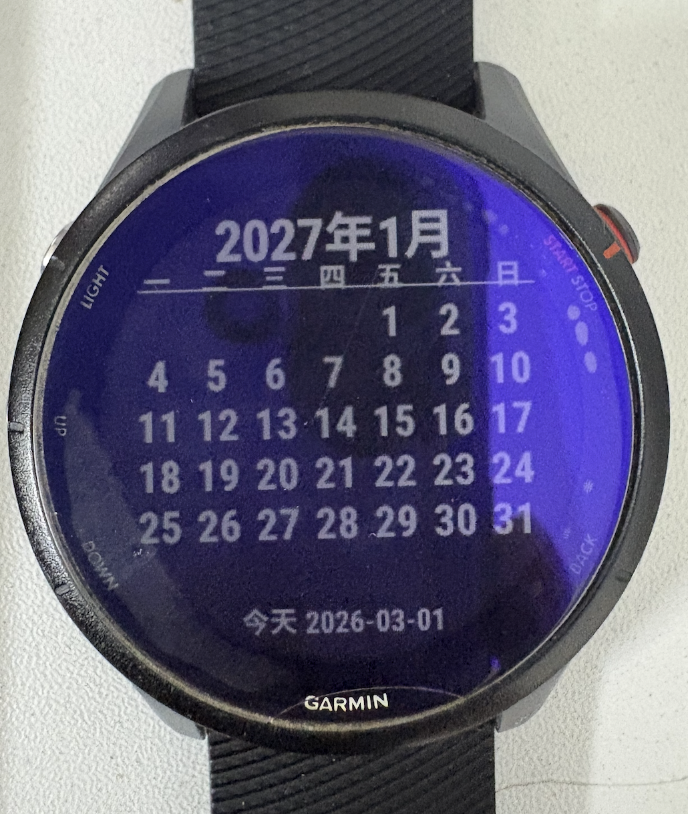
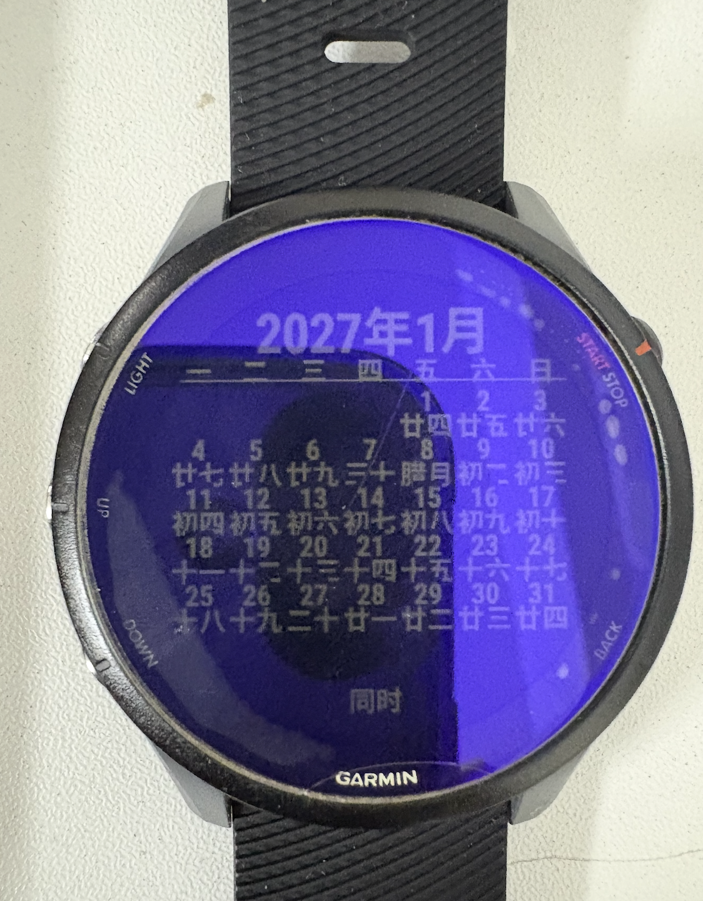

# GarminCalendar

English | [简体中文](README.zh-CN.md)

ConnectIQ: <https://apps.garmin.com/apps/81d408e1-3fd8-4627-af3a-a3e6a0a65d81>

佳明手表 fr255 日历，可以显示农历。

A Garmin Connect IQ watch app calendar with:
- Solar mode
- Lunar mode
- Both mode (solar + lunar in each day cell)
- Language switch: Simplified Chinese / Traditional Chinese / English

## Screenshots

### Calendar View


### Both Mode


## Features

- Highlight for today
- Month navigation
- Lunar conversion with month cache (performance-safe)
- Lunar day `1` displays lunar month name (e.g. 正月 / 閏二月 / M2)
- In-app menu settings:
  - Display mode: Solar / Lunar / Both
  - Language: 简体中文 / 繁體中文 / English
  - Go to today

## Build

Example build command:

```bash
java -Xms1g -Dfile.encoding=UTF-8 -Dapple.awt.UIElement=true \
-jar "/Users/i/Library/Application Support/Garmin/ConnectIQ/Sdks/connectiq-sdk-mac-8.4.1-2026-02-03-e9f77eeaa/bin/monkeybrains.jar" \
-o bin/Calendar.prg \
-f monkey.jungle \
-y /Users/i/Documents/Garmin/developer_key \
-d fr255_sim -w
```

Run in simulator:

```bash
"/Users/i/Library/Application Support/Garmin/ConnectIQ/Sdks/connectiq-sdk-mac-8.4.1-2026-02-03-e9f77eeaa/bin/monkeydo" \
bin/Calendar.prg fr255
```

## Notes

- App name is localized in resources for `eng`, `zhs`, `zht`.
- Launcher icon is updated to 40x40-compatible SVG.
